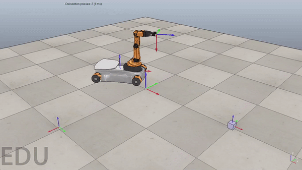

# Robotic Manipulation Simulation
### Author: Arun Kumar

#### Python code that generates a reference trajectory and uses a PI controller to follow the reference trajectory. Code outputs a csv file of robotic configuration at each time step. CoppeliaSim was used to animate the simulation.

#### Usage Instructions:
* Commented code is in the directory called code
* Milestones contains code that I used as intermediate steps in this project
* Results directory contains three directories (best, overshoot, and newTask)
    - best highlights a well-tuned feedforward-plus-PI controller
    - overshoot highlights a poorly-tuned feedforward-plus-PI controller
    - newTask demonstrates my code works under various conditions

<a href="https://ayerun.github.io/Portfolio/manipulation.html" target="_blank">Click Here For More Information</a>